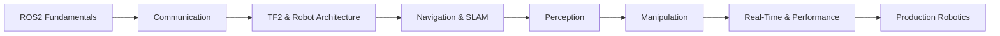

# 🤖 ROS2 Mastery Roadmap

<p align="center">
  <b>Master ROS2 from First Node → Autonomous Robot Systems</b><br>
  A complete project-based roadmap for robotics, autonomous systems, and production ROS2 development.
</p>

<p align="center">
  
  
  
  
</p>

---

## 🧠 About

**ROS2 Mastery** is a structured roadmap and question-bank system designed to help engineers master modern robotics software development.

It covers everything from:

✔ ROS2 Fundamentals  
✔ DDS & Middleware  
✔ Navigation & SLAM  
✔ Perception & Sensor Fusion  
✔ MoveIt2 & Manipulation  
✔ Real-Time Systems  
✔ Multi-Robot Systems  
✔ Production Deployment

Whether you're building:

- Mobile Robots
- Autonomous Vehicles
- Warehouse Robots
- Patrol Robots
- Industrial Manipulators
- Research Platforms

This roadmap takes you from beginner to production-grade ROS2 engineer.

---

## 🌐 Interactive Roadmap Tracker

📍 GitHub Pages Tracker:

https://srivathsan98.github.io/ROS2-Mastery/ROS2-Mastery-Tracker.html

📄 Tracker Source File: :contentReference[oaicite:0]{index=0}

---

## 🗺️ Roadmap Overview



---

## 📚 Learning Phases

---

# 🟢 Phase 01 — Foundation

Build strong ROS2 fundamentals.

### 🧱 ROS2 Architecture

* DDS
* RMW
* Workspaces
* Packages
* Colcon
* Ament

### 📡 Topics & Communication

* Publishers
* Subscribers
* QoS
* Message flow
* Remapping

### 🔧 Services & Actions

* Request / Response
* Goal / Feedback / Result
* Async execution

### ⚙️ Parameters

* YAML configuration
* Runtime updates
* Parameter callbacks

### 🚀 Launch System

* Python launch files
* Arguments
* Namespaces
* Node composition

---

# 🟡 Phase 02 — Intermediate

Learn how real robots are built.

### 🏗️ Lifecycle & Executors

* Lifecycle nodes
* Callback groups
* Executors
* Intra-process communication

### 🔨 Custom Interfaces

* Custom messages
* Services
* Actions
* rosidl

### 📐 TF2

* Transform trees
* Coordinate frames
* Broadcasters
* Listeners

### 🗺️ Navigation (Nav2)

* Costmaps
* Planners
* Controllers
* Recovery behaviors

### 🧭 SLAM

* slam_toolbox
* Cartographer
* RTAB-Map

### 📍 Localization

* AMCL
* EKF / UKF
* robot_localization

### 🔵 Perception

* Images
* Point clouds
* OpenCV
* PCL

### 🐍 rclpy

* Python ROS2 development
* Async programming
* OpenCV integration

---

# 🔴 Phase 03 — Advanced

Master autonomous and production robotics.

### 🌳 Behavior Trees

* BehaviorTree.CPP
* Nav2 BT
* Task planning

### 🦾 MoveIt2

* Motion planning
* Collision avoidance
* Servoing
* Manipulation

### 📊 Performance & Real-Time

* DDS tuning
* PREEMPT_RT
* ros2_tracing
* Latency analysis

### 🧪 Testing

* launch_testing
* GTest
* PyTest
* CI integration

### 🐛 Debugging

* rosbag2
* rqt tools
* Profiling
* Introspection

### 🌐 DDS Deep Dive

* Discovery
* QoS
* FastDDS
* CycloneDDS
* Multi-machine networking

### 📟 micro-ROS

* XRCE-DDS
* STM32
* ESP32
* FreeRTOS
* Zephyr

### 🔒 ROS2 Security

* DDS Security
* SROS2
* Certificates
* Permissions

### 🔄 Simulation

* Gazebo Harmonic
* ros_gz_bridge
* Isaac Sim
* Digital Twins

### 🧵 ros2_control

* Hardware interfaces
* Controllers
* Real robots

### 🚁 Multi-Robot Systems

* Fleet management
* Open-RMF
* Coordination
* Swarm robotics

### 🏭 Production Deployment

* Docker
* CI/CD
* Cross-compilation
* Monitoring
* Embedded deployment

---

## 📊 Question Bank Structure

| Phase | Questions Per Module |
|---------|--------------------|
| 🟢 Foundation | 15 Questions |
| 🟡 Intermediate | 20 Questions |
| 🔴 Advanced | 25 Questions |

Includes:

✅ Theory Questions  
✅ Coding Exercises  
✅ Debugging Scenarios  
✅ Architecture Design Questions  
✅ Production Robotics Workflows

---

## 🛠️ Tools & Technologies Covered

| Category | Tools |
|-----------|--------|
| Core ROS2 | rclcpp, rclpy |
| Navigation | Nav2 |
| Mapping | slam_toolbox, RTAB-Map |
| Localization | AMCL, robot_localization |
| Perception | OpenCV, PCL |
| Manipulation | MoveIt2 |
| Simulation | Gazebo, Isaac Sim |
| Control | ros2_control |
| Security | SROS2 |
| Embedded | micro-ROS |
| Testing | GTest, launch_testing |
| Monitoring | rosbag2, ros2_tracing |

---

## 🤖 Hands-On Projects

| Project | Level | Description |
|----------|--------|-------------|
| 📡 ROS2 Chat System | Beginner | Topics, services & actions |
| 🚗 TurtleBot Navigation | Beginner | Nav2 basics |
| 🗺️ Autonomous Mapper | Intermediate | SLAM + localization |
| 👁️ Object Detection Robot | Intermediate | OpenCV + ROS2 |
| 🤖 Smart Patrol Robot | Advanced | Navigation + perception |
| 🦾 Manipulator Control | Advanced | MoveIt2 |
| 📟 micro-ROS Sensor Network | Advanced | MCU integration |
| 🚁 Multi-Robot Fleet | Expert | OpenRMF + coordination |

---

## 📁 Repository Structure

```bash
ROS2-Mastery/
│
├── 01-core-concepts/
├── 02-topics-services-actions/
├── 03-launch-parameters/
├── 04-tf2/
├── 05-navigation/
├── 06-slam/
├── 07-localization/
├── 08-perception/
├── 09-rclpy/
├── 10-behavior-trees/
├── 11-moveit2/
├── 12-real-time/
├── 13-testing/
├── 14-debugging/
├── 15-dds/
├── 16-micro-ros/
├── 17-security/
├── 18-simulation/
├── 19-ros2-control/
├── 20-multi-robot/
├── 21-production/
├── projects/
├── docs/
└── README.md
```

---

## ⚡ Quick Start

```bash
# Clone repository
git clone https://github.com/Srivathsan98/ROS2-Mastery.git

# Enter repository
cd ROS2-Mastery

# Source ROS2
source /opt/ros/humble/setup.bash

# Build workspace
colcon build

# Source workspace
source install/setup.bash
```

---

## 🎯 End Goal

By completing this roadmap, you should be able to:

✅ Design ROS2 architectures from scratch  
✅ Build autonomous mobile robots  
✅ Implement SLAM & Navigation systems  
✅ Develop perception pipelines  
✅ Integrate sensors, LiDARs & cameras  
✅ Build manipulation systems with MoveIt2  
✅ Deploy ROS2 on embedded platforms  
✅ Build multi-robot systems  
✅ Debug large robotics applications  
✅ Ship production-grade robotic software

---

## 🚀 Career Paths

This roadmap prepares you for roles such as:

* Robotics Software Engineer
* Autonomous Systems Engineer
* ROS2 Developer
* Navigation Engineer
* SLAM Engineer
* Perception Engineer
* Controls Engineer
* Embedded Robotics Engineer
* Autonomous Vehicle Engineer

---

## 🤝 Contributing

Want to improve this roadmap?

1. Fork the repository
2. Create a branch
3. Add content or projects
4. Submit a Pull Request

---

## ⭐ Support

If this roadmap helped you:

👉 Star the repository  
👉 Share it with fellow roboticists  
👉 Contribute projects & learning resources

---

## 📜 License

MIT License

---

<p align="center">
  Built with 🤖 + ☕ + autonomy + endless debugging
</p>